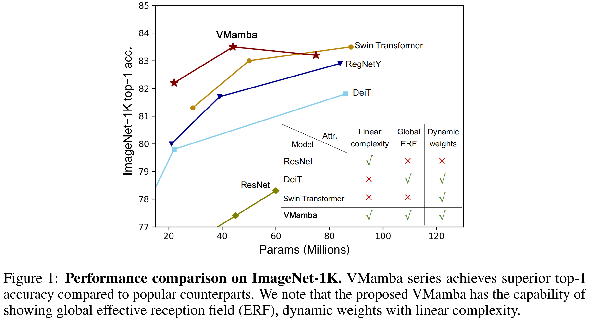
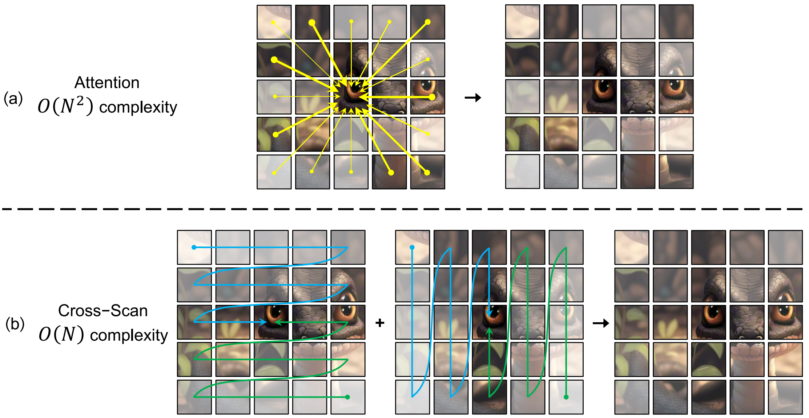

<div align="center">
<h1>VMamba </h1>
<h3>VMamba: Visual State Space Models</h3>

[Yue Liu](https://github.com/MzeroMiko)<sup>1</sup>,[Yunjie Tian](https://sunsmarterjie.github.io/)<sup>1</sup>,[Yuzhong Zhao](https://scholar.google.com.hk/citations?user=tStQNm4AAAAJ&hl=zh-CN&oi=ao)<sup>1</sup>, [Hongtian Yu](https://github.com/yuhongtian17)<sup>1</sup>, [Lingxi Xie](https://scholar.google.com.hk/citations?user=EEMm7hwAAAAJ&hl=zh-CN&oi=ao)<sup>2</sup>, [Yaowei Wang](https://scholar.google.com.hk/citations?user=o_DllmIAAAAJ&hl=zh-CN&oi=ao)<sup>3</sup>, [Qixiang Ye](https://scholar.google.com.hk/citations?user=tjEfgsEAAAAJ&hl=zh-CN&oi=ao)<sup>1</sup>, [Yunfan Liu](https://scholar.google.com.hk/citations?user=YPL33G0AAAAJ&hl=zh-CN&oi=ao)<sup>1</sup>

<sup>1</sup>  University of Chinese Academy of Sciences, <sup>2</sup>  HUAWEI Inc.,  <sup>3</sup> PengCheng Lab.

ArXiv Preprint: ([arXiv 2401.10166](https://arxiv.org/abs/2401.10166))


## Updates

* **` Jan. 19th, 2024`:** The source code for classification, object detection, and semantic segmentation are provided. The pre-trained models will be released in few days!


## Introduction

**VMamba** is initially described in [arxiv](https://arxiv.org/abs/2401.10166), which capably serves as a
general-purpose backbone for computer vision with linear complexity and shows the advantages of global receptive fields and dynamic weights.

<p align="center">
  
</p>

***The base level model is being trained and the top-1 accuracy has reached to 83.56 at 210-th epoch. We will update the latest results as soon as possible.*** 

**VMamba is linear complexity with 2D-Selective-Scan**

<p align="center">
  
</p>

**VMamba has global effective receptive field**

<p align="center">
  
</p>

**Main Architecture of VMamba**

<p align="center">
  
</p>

## Main Results on ImageNet

We will release all the pre-trained models in few days!

**ImageNet-1K VMamba Models**


<!-- | name | pretrain | resolution |acc@1 | acc@5 | #params | FLOPs | FPS| 22K model | 1K model |
| :---: | :---: | :---: | :---: | :---: | :---: | :---: | :---: |:---: |:---: |
| Swin-T | ImageNet-1K | 224x224 | 81.2 | 95.5 | 28M | 4.5G | 755 | - | [github](...)/[baidu](...)/[config](classification/configs/vssm/vssm_tiny_224.yaml)/[log](...) |
| Swin-S | ImageNet-1K | 224x224 | 83.2 | 96.2 | 50M | 8.7G | 437 | - | [github](...)/[baidu](...)/[config](classification/configs/vssm/vssm_small_224.yaml)/[log](...) |
| Swin-B | ImageNet-1K | 224x224 | 83.5 | 96.5 | 88M | 15.4G | 278  | - | [github](...)/[config](classification/configs/vssm/vssm_base_224.yaml)/[log](...) | -->


## Main Results on Downstream Tasks

**COCO Object Detection (2017 val)**

<!-- | Backbone | Method | pretrain | Lr Schd | box mAP | mask mAP | #params | FLOPs |
| :---: | :---: | :---: | :---: | :---: | :---: | :---: | :---: |
| VMamba-T | Mask R-CNN | ImageNet-1K | 1x | / | / | 48M | 267G |
| VMamba-S | Mask R-CNN | ImageNet-1K | 1x | / | / | 69M | 359G |
| Swin-S | Mask R-CNN | ImageNet-1K | 1x | / | / | 69M | 359G | -->


**ADE20K Semantic Segmentation (val)**

<!-- | Backbone | Method | pretrain | Crop Size | Lr Schd | mIoU | mIoU (ms+flip) | #params | FLOPs |
| :---: | :---: | :---: | :---: | :---: | :---: | :---: | :---: | :---: |
| Swin-T | UPerNet | ImageNet-1K | 512x512 | 160K | 44.51 | 45.81 | 60M | 945G |
| Swin-S | UperNet | ImageNet-1K | 512x512 | 160K | 47.64 | 49.47 | 81M | 1038G |
| Swin-B | UperNet | ImageNet-1K | 512x512 | 160K | 48.13 | 49.72 | 121M | 1188G |
| Swin-B | UPerNet | ImageNet-22K | 640x640 | 160K | 50.04 | 51.66 | 121M | 1841G |
| Swin-L | UperNet | ImageNet-22K | 640x640 | 160K | 52.05 | 53.53 | 234M | 3230G | -->


## Getting Started

- For installation, training and testing, please see [modelcard.sh](modelcard.sh) for detailed instructions.

## Cite VMamba:

```
@misc{liu2024vmamba,
      title={VMamba: Visual State Space Model}, 
      author={Yue Liu and Yunjie Tian and Yuzhong Zhao and Hongtian Yu and Lingxi Xie and Yaowei Wang and Qixiang Ye and Yunfan Liu},
      year={2024},
      eprint={2401.10166},
      archivePrefix={arXiv},
      primaryClass={cs.CV}
}
```

## Acknowledgment

This project is based on Mamba ([paper](https://arxiv.org/abs/2312.00752), [code](https://github.com/state-spaces/mamba)), Swin-Transformer ([paper](https://arxiv.org/pdf/2103.14030.pdf), [code](https://github.com/microsoft/Swin-Transformer)), ConvNeXt ([paper](https://arxiv.org/abs/2201.03545), [code](https://github.com/facebookresearch/ConvNeXt)),
and the analyze/get_erf.py is adopted from [replknet](https://github.com/DingXiaoH/RepLKNet-pytorch/tree/main/erf), thanks for their excellent works.

