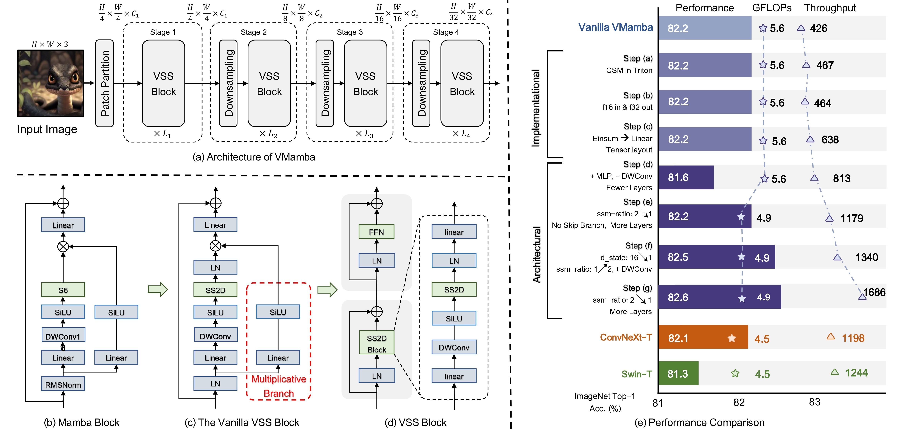
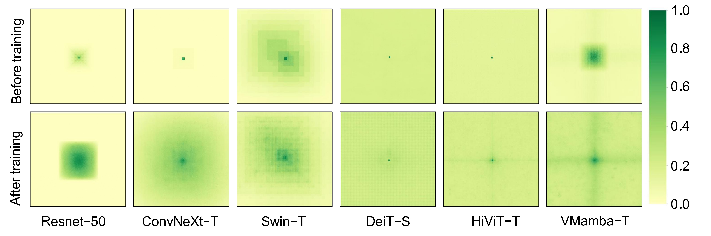
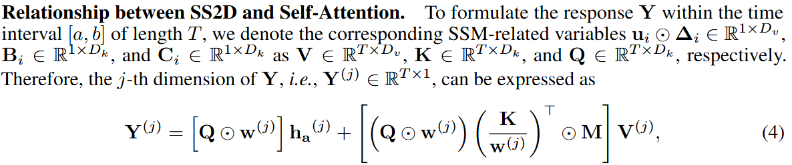
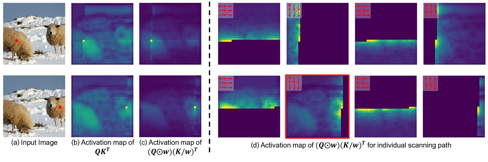

<div align="center">
<h1>VMamba </h1>
<h3>VMamba: Visual State Space Model</h3>

[Yue Liu](https://github.com/MzeroMiko)<sup>1</sup>,[Yunjie Tian](https://sunsmarterjie.github.io/)<sup>1</sup>,[Yuzhong Zhao](https://scholar.google.com.hk/citations?user=tStQNm4AAAAJ&hl=zh-CN&oi=ao)<sup>1</sup>, [Hongtian Yu](https://github.com/yuhongtian17)<sup>1</sup>, [Lingxi Xie](https://scholar.google.com.hk/citations?user=EEMm7hwAAAAJ&hl=zh-CN&oi=ao)<sup>2</sup>, [Yaowei Wang](https://scholar.google.com.hk/citations?user=o_DllmIAAAAJ&hl=zh-CN&oi=ao)<sup>3</sup>, [Qixiang Ye](https://scholar.google.com.hk/citations?user=tjEfgsEAAAAJ&hl=zh-CN&oi=ao)<sup>1</sup>, [Yunfan Liu](https://scholar.google.com.hk/citations?user=YPL33G0AAAAJ&hl=zh-CN&oi=ao)<sup>1</sup>

<sup>1</sup>  University of Chinese Academy of Sciences, <sup>2</sup>  HUAWEI Inc.,  <sup>3</sup> PengCheng Lab.

Paper: ([arXiv 2401.10166](https://arxiv.org/abs/2401.10166))

</div>

* [**updates**](#white_check_mark-updates)
* [**abstract**](#abstract)
* [**overview**](#overview--derivations)
* [**main results**](#main-results)
* [**getting started**](#getting-started)
* [**star history**](#star-history)
* [**citation**](#citation)
* [**acknowledgment**](#acknowledgment)

## :white_check_mark: Updates
* **`Sep. 25th, 2024`**: Update: **VMamba is accepted by NeurIPS2024 (spotlight)!**
* **`June. 14th, 2024`**: Update: we clean the code to be easier to read; we add support for `mamba2`.
* **`May. 26th, 2024`**: Update: we release the updated weights of VMambav2, together with the new arxiv paper.
* **`May. 7th, 2024`**: Update: **Important!** using `torch.backends.cudnn.enabled=True` in downstream tasks may be quite slow. If you found vmamba quite slow in your machine, disable it in vmamba.py, else, ignore this.
* **...**

***for details see [detailed_updates.md](assets/detailed_updates.md)***

## Abstract

Designing computationally efficient network architectures persists as an ongoing necessity in computer vision. In this paper, we transplant Mamba, a state-space language model, into VMamba, a vision backbone that works in linear time complexity. At the core of VMamba lies a stack of Visual State-Space (VSS) blocks with the 2D Selective Scan (SS2D) module. By traversing along four scanning routes, SS2D helps bridge the gap between the ordered nature of 1D selective scan and the non-sequential structure of 2D vision data, which facilitates the gathering of contextual information from various sources and perspectives. Based on the VSS blocks, we develop a family of VMamba architectures and accelerate them through a succession of architectural and implementation enhancements. Extensive experiments showcase VMamba’s promising performance across diverse visual perception tasks, highlighting its advantages in input scaling efficiency compared to existing benchmark models.

## Overview

* [**VMamba**](https://arxiv.org/abs/2401.10166) serves as a general-purpose backbone for computer vision.

<p align="center">
  
</p>

* **2D-Selective-Scan of VMamba**

<p align="center">
  
</p>

* **VMamba has global effective receptive field**

<p align="center">
  
</p>

* **VMamba resembles Transformer-Based Methods in Activation Map**
<p align="center">
  
</p>
<p align="center">
  
</p>

## Main Results
<!-- copied from assets/performance.md  -->

<!-- :book: -->
<!-- ***The checkpoints of some of the models listed below will be released in weeks!*** -->

:book:
***For details see [performance.md](./assets/performance.md).***

### **Classification on ImageNet-1K**
| name | pretrain | resolution |acc@1 | #params | FLOPs | TP. | Train TP. | configs/logs/ckpts |
| :---: | :---: | :---: | :---: | :---: | :---: | :---: | :---: | :---: |
| Swin-T | ImageNet-1K | 224x224 | 81.2 | 28M | 4.5G | 1244 |987 | -- |
| Swin-S | ImageNet-1K | 224x224 | 83.2 | 50M | 8.7G | 718 |642 | -- |
| Swin-B | ImageNet-1K | 224x224 | 83.5 | 88M | 15.4G | 458 |496 | -- |
| VMamba-S[`s2l15`] | ImageNet-1K | 224x224 | 83.6 | 50M | 8.7G | 877 | 314| [config](classification/configs/vssm/vmambav2_small_224.yaml)/[log](https://github.com/MzeroMiko/VMamba/releases/download/%23v2cls/vssm_small_0229.txt)/[ckpt](https://github.com/MzeroMiko/VMamba/releases/download/%23v2cls/vssm_small_0229_ckpt_epoch_222.pth) |
| VMamba-B[`s2l15`] | ImageNet-1K | 224x224 | 83.9 | 89M | 15.4G | 646 | 247 | [config](classification/configs/vssm/vmambav2_base_224.yaml)/[log](https://github.com/MzeroMiko/VMamba/releases/download/%23v2cls/vssm_base_0229.txt)/[ckpt](https://github.com/MzeroMiko/VMamba/releases/download/%23v2cls/vssm_base_0229_ckpt_epoch_237.pth) |
| VMamba-T[`s1l8`] | ImageNet-1K | 224x224 | 82.6 | 30M | 4.9G | 1686| 571| [config](classification/configs/vssm/vmambav2v_tiny_224.yaml)/[log](https://github.com/MzeroMiko/VMamba/releases/download/%23v2cls/vssm1_tiny_0230s.txt)/[ckpt](https://github.com/MzeroMiko/VMamba/releases/download/%23v2cls/vssm1_tiny_0230s_ckpt_epoch_264.pth) |


* *Models in this subsection is trained from scratch with random or manual initialization. The hyper-parameters are inherited from Swin, except for `drop_path_rate` and `EMA`. All models are trained with EMA except for the `Vanilla-VMamba-T`.*
* *`TP.(Throughput)` and `Train TP. (Train Throughput)` are assessed on an A100 GPU paired with an AMD EPYC 7542 CPU, with batch size 128. `Train TP.` is tested with mix-resolution, excluding the time consumption of optimizers.*
* *`FLOPs` and `parameters` are now gathered with `head` (In previous versions, they were counted without head, so the numbers raise a little bit).*
* *we calculate `FLOPs` with the algorithm @albertgu [provides](https://github.com/state-spaces/mamba/issues/110), which will be bigger than previous calculation (which is based on the `selective_scan_ref` function, and ignores the hardware-aware algorithm).*


### **Object Detection on COCO**
  
| Backbone | #params | FLOPs | Detector | bboxAP | bboxAP50 | bboxAP75 | segmAP | segmAP50 | segmAP75 | configs/logs/ckpts |
| :---: | :---: | :---: | :---: | :---: | :---: |:---: |:---: |:---: |:---: |:---: |
| Swin-T | 48M | 267G | MaskRCNN@1x | 42.7 |65.2 |46.8 |39.3 |62.2 |42.2 |-- |
| Swin-S | 69M | 354G | MaskRCNN@1x | 44.8 |66.6 |48.9 |40.9 |63.4 |44.2 |-- |-- |
| Swin-B | 107M | 496G | MaskRCNN@1x | 46.9|--|--| 42.3|--|--|-- |-- |
| VMamba-S[`s2l15`] | 70M | 384G | MaskRCNN@1x | 48.7 |70.0 |53.4 |43.7 |67.3 |47.0 | [config](detection/configs/vssm1/mask_rcnn_vssm_fpn_coco_small.py)/[log](https://github.com/MzeroMiko/VMamba/releases/download/%23v2det/mask_rcnn_vssm_fpn_coco_small.log)/[ckpt](https://github.com/MzeroMiko/VMamba/releases/download/%23v2det/mask_rcnn_vssm_fpn_coco_small_epoch_11.pth) |
| VMamba-B[`s2l15`] | 108M | 485G | MaskRCNN@1x | 49.2 |71.4 |54.0 |44.1 |68.3 |47.7 | [config](detection/configs/vssm1/mask_rcnn_vssm_fpn_coco_base.py)/[log](https://github.com/MzeroMiko/VMamba/releases/download/%23v2det/mask_rcnn_vssm_fpn_coco_base.log)/[ckpt](https://github.com/MzeroMiko/VMamba/releases/download/%23v2det/mask_rcnn_vssm_fpn_coco_base_epoch_11.pth) |
| VMamba-B[`s2l15`] | 108M | 485G | MaskRCNN@1x[`bs8`] | 49.2 |70.9 |53.9 |43.9 |67.7 |47.6 | [config](detection/configs/vssm1/mask_rcnn_vssm_fpn_coco_base.py)/[log](https://github.com/MzeroMiko/VMamba/releases/download/%23v2det/mask_rcnn_vssm_fpn_coco_base_bs8.log)/[ckpt](https://github.com/MzeroMiko/VMamba/releases/download/%23v2det/mask_rcnn_vssm_fpn_coco_base_epoch_12_bs8.pth) |
| VMamba-T[`s1l8`] | 50M | 271G | MaskRCNN@1x | 47.3 |69.3 |52.0 |42.7 |66.4 |45.9 | [config](detection/configs/vssm1/mask_rcnn_vssm_fpn_coco_tiny.py)/[log](https://github.com/MzeroMiko/VMamba/releases/download/%23v2det/mask_rcnn_vssm_fpn_coco_tiny_s.log)/[ckpt](https://github.com/MzeroMiko/VMamba/releases/download/%23v2det/mask_rcnn_vssm_fpn_coco_tiny_s_epoch_12.pth) |
| :---: | :---: | :---: | :---: | :---: | :---: |:---: |:---: |:---: |:---: |:---: |:---: |:---: |
| Swin-T | 48M | 267G | MaskRCNN@3x | 46.0 |68.1 |50.3 |41.6 |65.1 |44.9 |-- |
| Swin-S | 69M | 354G | MaskRCNN@3x | 48.2 |69.8 |52.8 |43.2 |67.0 |46.1  |-- |
| VMamba-S[`s2l15`] | 70M | 384G | MaskRCNN@3x | 49.9 |70.9 |54.7 |44.20 |68.2 |47.7 | [config](detection/configs/vssm1/mask_rcnn_vssm_fpn_coco_small_ms_3x.py)/[log](https://github.com/MzeroMiko/VMamba/releases/download/%23v2det/mask_rcnn_vssm_fpn_coco_small_ms_3x.log)/[ckpt](https://github.com/MzeroMiko/VMamba/releases/download/%23v2det/mask_rcnn_vssm_fpn_coco_small_ms_3x_epoch_32.pth) |
| VMamba-T[`s1l8`] | 50M | 271G | MaskRCNN@3x | 48.8 |70.4 |53.50 |43.7 |67.4 |47.0 | [config](detection/configs/vssm1/mask_rcnn_vssm_fpn_coco_tiny_ms_3x.py)/[log](https://github.com/MzeroMiko/VMamba/releases/download/%23v2det/mask_rcnn_vssm_fpn_coco_tiny_ms_3x_s.log)/[ckpt](https://github.com/MzeroMiko/VMamba/releases/download/%23v2det/mask_rcnn_vssm_fpn_coco_tiny_ms_3x_s_epoch_31.pth) |


* *Models in this subsection is initialized from the models trained in `classfication`.*
* *we now calculate FLOPs with the algrithm @albertgu [provides](https://github.com/state-spaces/mamba/issues/110), which will be bigger than previous calculation (which is based on the `selective_scan_ref` function, and ignores the hardware-aware algrithm).*

### **Semantic Segmentation on ADE20K**

| Backbone | Input|  #params | FLOPs | Segmentor | mIoU(SS) | mIoU(MS) | configs/logs/logs(ms)/ckpts |
| :---: | :---: | :---: | :---: | :---: | :---: |:---: |:---: |
| Swin-T | 512x512 | 60M | 945G | UperNet@160k | 44.4| 45.8| -- |
| Swin-S | 512x512 | 81M | 1039G | UperNet@160k | 47.6| 49.5| -- |
| Swin-B | 512x512 | 121M | 1188G | UperNet@160k | 48.1| 49.7|-- |
| VMamba-S[`s2l15`] | 512x512 | 82M | 1028G | UperNet@160k | 50.6| 51.2|[config](segmentation/configs/vssm1/upernet_vssm_4xb4-160k_ade20k-512x512_small.py)/[log](https://github.com/MzeroMiko/VMamba/releases/download/%23v2seg/upernet_vssm_4xb4-160k_ade20k-512x512_small.log)/[log(ms)](https://github.com/MzeroMiko/VMamba/releases/download/%23v2seg/upernet_vssm_4xb4-160k_ade20k-512x512_small_tta.log)/[ckpt](https://github.com/MzeroMiko/VMamba/releases/download/%23v2seg/upernet_vssm_4xb4-160k_ade20k-512x512_small_iter_144000.pth) |
| VMamba-B[`s2l15`] | 512x512 | 122M | 1170G | UperNet@160k | 51.0| 51.6|[config](segmentation/configs/vssm1/upernet_vssm_4xb4-160k_ade20k-512x512_base.py)/[log](https://github.com/MzeroMiko/VMamba/releases/download/%23v2seg/upernet_vssm_4xb4-160k_ade20k-512x512_base.log)/[log(ms)](https://github.com/MzeroMiko/VMamba/releases/download/%23v2seg/upernet_vssm_4xb4-160k_ade20k-512x512_base_tta.log)/[ckpt](https://github.com/MzeroMiko/VMamba/releases/download/%23v2seg/upernet_vssm_4xb4-160k_ade20k-512x512_base_iter_160000.pth) |
| VMamba-T[`s1l8`] | 512x512 | 62M | 949G | UperNet@160k | 47.9| 48.8| [config](segmentation/configs/vssm1/upernet_vssm_4xb4-160k_ade20k-512x512_tiny.py)/[log](https://github.com/MzeroMiko/VMamba/releases/download/%23v2seg/upernet_vssm_4xb4-160k_ade20k-512x512_tiny_s.log)/[log(ms)](https://github.com/MzeroMiko/VMamba/releases/download/%23v2seg/upernet_vssm_4xb4-160k_ade20k-512x512_tiny_s_tta.log)/[ckpt](https://github.com/MzeroMiko/VMamba/releases/download/%23v2seg/upernet_vssm_4xb4-160k_ade20k-512x512_tiny_s_iter_160000.pth) |


* *Models in this subsection is initialized from the models trained in `classfication`.*
* *we now calculate FLOPs with the algrithm @albertgu [provides](https://github.com/state-spaces/mamba/issues/110), which will be bigger than previous calculation (which is based on the `selective_scan_ref` function, and ignores the hardware-aware algrithm).*

## Getting Started

### Installation

**Step 1: Clone the VMamba repository:**

To get started, first clone the VMamba repository and navigate to the project directory:

```bash
git clone https://github.com/MzeroMiko/VMamba.git
cd VMamba
```

**Step 2: Environment Setup:**

VMamba recommends setting up a conda environment and installing dependencies via pip. Use the following commands to set up your environment:
Also, We recommend using the pytorch>=2.0, cuda>=11.8. But lower version of pytorch and CUDA are also supported.

***Create and activate a new conda environment***

```bash
conda create -n vmamba
conda activate vmamba
```

***Install Dependencies***

```bash
pip install -r requirements.txt
cd kernels/selective_scan && pip install .
```
<!-- cd kernels/cross_scan && pip install . -->

***Check Selective Scan (optional)***

* If you want to check the modules compared with `mamba_ssm`, install [`mamba_ssm`](https://github.com/state-spaces/mamba) first!

* If you want to check if the implementation of `selective scan` of ours is the same with `mamba_ssm`, `selective_scan/test_selective_scan.py` is here for you. Change to `MODE = "mamba_ssm_sscore"` in `selective_scan/test_selective_scan.py`, and run `pytest selective_scan/test_selective_scan.py`.

* If you want to check if the implementation of `selective scan` of ours is the same with reference code (`selective_scan_ref`), change to `MODE = "sscore"` in `selective_scan/test_selective_scan.py`, and run `pytest selective_scan/test_selective_scan.py`.

* `MODE = "mamba_ssm"` stands for checking whether the results of `mamba_ssm` is close to `selective_scan_ref`, and `"sstest"` is preserved for development. 

* If you find `mamba_ssm` (`selective_scan_cuda`) or `selective_scan` ( `selctive_scan_cuda_core`) is not close enough to `selective_scan_ref`, and the test failed, do not worry. Check if `mamba_ssm` and `selective_scan` are close enough [instead](https://github.com/state-spaces/mamba/pull/161).

* ***If you are interested in selective scan, you can check [mamba](https://github.com/state-spaces/mamba), [mamba-mini](https://github.com/MzeroMiko/mamba-mini), [mamba.py](https://github.com/alxndrTL/mamba.py) [mamba-minimal](https://github.com/johnma2006/mamba-minimal) for more information.***

***Dependencies for `Detection` and `Segmentation` (optional)***

```bash
pip install mmengine==0.10.1 mmcv==2.1.0 opencv-python-headless ftfy regex
pip install mmdet==3.3.0 mmsegmentation==1.2.2 mmpretrain==1.2.0
```

### Model Training and Inference

**Classification**

To train VMamba models for classification on ImageNet, use the following commands for different configurations:

```bash
python -m torch.distributed.launch --nnodes=1 --node_rank=0 --nproc_per_node=8 --master_addr="127.0.0.1" --master_port=29501 main.py --cfg </path/to/config> --batch-size 128 --data-path </path/of/dataset> --output /tmp
```

If you only want to test the performance (together with params and flops):

```bash
python -m torch.distributed.launch --nnodes=1 --node_rank=0 --nproc_per_node=1 --master_addr="127.0.0.1" --master_port=29501 main.py --cfg </path/to/config> --batch-size 128 --data-path </path/of/dataset> --output /tmp --pretrained </path/of/checkpoint>
```

***please refer to [modelcard](./modelcard.sh) for more details.***

**Detection and Segmentation**

To evaluate with `mmdetection` or `mmsegmentation`:
```bash
bash ./tools/dist_test.sh </path/to/config> </path/to/checkpoint> 1
```
*use `--tta` to get the `mIoU(ms)` in segmentation*

To train with `mmdetection` or `mmsegmentation`:
```bash
bash ./tools/dist_train.sh </path/to/config> 8
```

For more information about detection and segmentation tasks, please refer to the manual of [`mmdetection`](https://mmdetection.readthedocs.io/en/latest/user_guides/train.html) and [`mmsegmentation`](https://mmsegmentation.readthedocs.io/en/latest/user_guides/4_train_test.html). Remember to use the appropriate backbone configurations in the `configs` directory.

### Analysis Tools

VMamba includes tools for visualizing mamba "attention" and effective receptive field, analysing throughput and train-throughput. Use the following commands to perform analysis:

```bash
# Visualize Mamba "Attention"
CUDA_VISIBLE_DEVICES=0 python analyze/attnmap.py

# Analyze the effective receptive field
CUDA_VISIBLE_DEVICES=0 python analyze/erf.py

# Analyze the throughput and train throughput
CUDA_VISIBLE_DEVICES=0 python analyze/tp.py

```

***We also included other analysing tools that we may use in this project. Thanks to all who have contributes to these tools.***


## Star History

[](https://star-history.com/#MzeroMiko/VMamba&Date)

## Citation

```
@article{liu2024vmamba,
  title={VMamba: Visual State Space Model},
  author={Liu, Yue and Tian, Yunjie and Zhao, Yuzhong and Yu, Hongtian and Xie, Lingxi and Wang, Yaowei and Ye, Qixiang and Liu, Yunfan},
  journal={arXiv preprint arXiv:2401.10166},
  year={2024}
}
```

## Acknowledgment

This project is based on Mamba ([paper](https://arxiv.org/abs/2312.00752), [code](https://github.com/state-spaces/mamba)), Swin-Transformer ([paper](https://arxiv.org/pdf/2103.14030.pdf), [code](https://github.com/microsoft/Swin-Transformer)), ConvNeXt ([paper](https://arxiv.org/abs/2201.03545), [code](https://github.com/facebookresearch/ConvNeXt)), [OpenMMLab](https://github.com/open-mmlab),
and the `analyze/get_erf.py` is adopted from [replknet](https://github.com/DingXiaoH/RepLKNet-pytorch/tree/main/erf), thanks for their excellent works.

* **We release [Fast-iTPN](https://github.com/sunsmarterjie/iTPN/tree/main/fast_itpn) recently, which reports the best performance on ImageNet-1K at Tiny/Small/Base level models as far as we know. (Tiny-24M-86.5%, Small-40M-87.8%, Base-85M-88.75%)**
