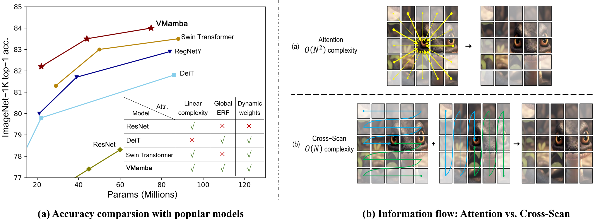
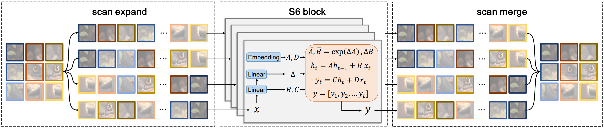
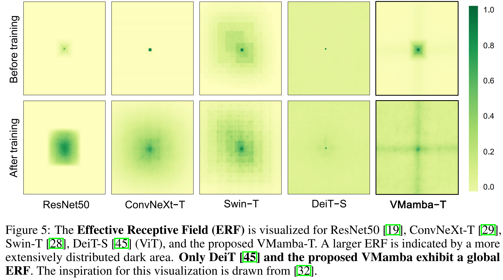
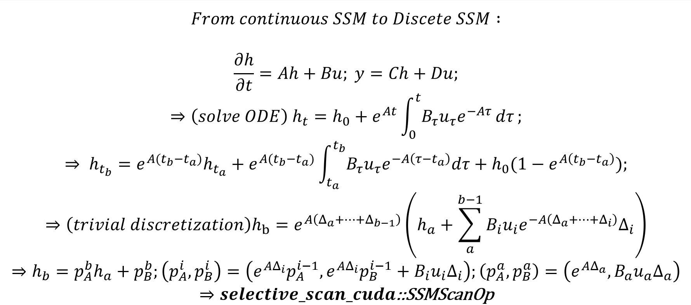

<div align="center">
<h1>VMamba </h1>
<h3>VMamba: Visual State Space Model</h3>

[Yue Liu](https://github.com/MzeroMiko)<sup>1</sup>,[Yunjie Tian](https://sunsmarterjie.github.io/)<sup>1</sup>,[Yuzhong Zhao](https://scholar.google.com.hk/citations?user=tStQNm4AAAAJ&hl=zh-CN&oi=ao)<sup>1</sup>, [Hongtian Yu](https://github.com/yuhongtian17)<sup>1</sup>, [Lingxi Xie](https://scholar.google.com.hk/citations?user=EEMm7hwAAAAJ&hl=zh-CN&oi=ao)<sup>2</sup>, [Yaowei Wang](https://scholar.google.com.hk/citations?user=o_DllmIAAAAJ&hl=zh-CN&oi=ao)<sup>3</sup>, [Qixiang Ye](https://scholar.google.com.hk/citations?user=tjEfgsEAAAAJ&hl=zh-CN&oi=ao)<sup>1</sup>, [Yunfan Liu](https://scholar.google.com.hk/citations?user=YPL33G0AAAAJ&hl=zh-CN&oi=ao)<sup>1</sup>

<sup>1</sup>  University of Chinese Academy of Sciences, <sup>2</sup>  HUAWEI Inc.,  <sup>3</sup> PengCheng Lab.

Paper: ([arXiv 2401.10166](https://arxiv.org/abs/2401.10166))

</div>

* [**updates**](#white_check_mark-updates)
* [**speed up history**](#rocket-the-history-of-speed-up)
* [**abstract**](#abstract)
* [**overview & derivation**](#overview--derivations)
* [**main results**](#main-results)
* [**getting started**](#getting-started)
* [**star history**](#star-history)
* [**citation**](#citation)
* [**acknowledgment**](#acknowledgment)

## :white_check_mark: Updates
* **` March. 16th, 2024`**: Update: we have released the `configs/logs/checkpoints` for classification of VMambav2. We'are still working on VMambav3! 

* **` March. 16th, 2024`**: Improvement: we implemented models with channel_first data layout, which GREATLY raises the `throughput` of the model on A100 (On V100, due to the slow implementation of F.conv2d compared to F.linear, it would not speed up.), Try using `norm_layer="ln2d"` (when inferencing or training) rather than `norm_layer="ln"` to unlock this feature with almost no performance cost!

* **` March. 8th, 2024`**: Update + Improvement: we update the performance of `VMamba-T`, `Vmamba-S`, `VMamba-B` with nightly build, checkpoints and logs are coming soon. (Note that these models are trained without `CrossScanTriton` or `forwardtype=v4`, you can modify those configs yourself to raise the speed with almost no cost!)

* **` March. 8th, 2024`**: Improvement: we implemented `CrossScan` and `CrossMerge` in `triton`, which speed the training up again. `CrossScan` and `CrossMerge` implemented in triton is ~2x faster than implemented in pytorch. Meanwhile, use `v4` rather than `v3` or `v2` in forwardtype also raise the speed GREATLY!.

* **` Feb. 26th, 2024`:** Improvement: we now support flexible output of `selective scan`. That means whatever type the input is, the output can always be float32. The feature is useful as when training with float16, the loss often get nan due to the overflow over float16. In the meantime, training with float32 costs more time. Input with float16 and output with float32 can be fast, but in the meantime, the loss is less likely to be NaN.   Try `SelectiveScanOflex` with float16 input and float32 output to enjoy that feature!

* **` Feb. 22th, 2024`:** Pre-Release: we set a pre-release to share nightly-build checkpoints in classificaion. Feel free to enjoy those new features with faster code and higher performance! 

* **` Feb. 18th, 2024`:** Release: all the checkpoints and logs of `VMamba` (`VSSM version 0`) in classification have been released. These checkpoints correspond to the experiments done before date #20240119, if there is any mismatch to the latest code in main, please let me know, and I'll fix that. This is related to issue#1 and issue#37.

* **` Feb. 16th, 2024`:** Fix bug + Improvement: `SS2D.forward_corev1` is deprecated. Fixed some bugs related to issue#30 (in test_selective scan.py, we now compare `ours` with `mamba_ssm` rather than `selective_scan_ref`), issue#32, issue#31. `backward nrow` has been added and tested in selective_scan.

* **` Feb. 4th, 2024`:** Fix bug + Improvement: Do not use `SS2D.forward_corev1` with `float32=False` for training (testing is ok), as it's unstable training in float16 for selective scan. We released `SS2D.forward_corev2`, which is in float32, and is faster than `SS2D.forward_corev1`.

* **` Feb. 1st, 2024`:** Fix bug: we now calculate FLOPs with the algrithm @albertgu [provides](https://github.com/state-spaces/mamba/issues/110), which will be bigger than previous calculation (which is based on the `selective_scan_ref` function, and ignores the hardware-aware algrithm).

* **` Jan. 31st, 2024`:** ~~Add feature: `selective_scan` now supports an extra argument `nrow` in `[1, 2, 4]`. If you find your device is strong and the time consumption keeps as `d_state` rises, try this feature to speed up `nrows` x without any cost ! Note this feature is actually a `bug fix` for [mamba](https://github.com/state-spaces/mamba).~~

* **` Jan. 28th, 2024`:** Add feature: we cloned main into a new branch called `20240128-achieve`, the main branch has experienced a great update now. The code now are much easier to use in your own project, and the training speed is faster! This new version is totally compatible with original one, and you can use previous checkpoints without any modification. But if you want to use exactly the same models as original ones, just change `forward_core = self.forward_corev1` into `forward_core = self.forward_corev0` in `classification/models/vmamba/vmamba.py#SS2D` or you can change into the branch `20240128-archive` instead.

* **` Jan. 23th, 2024`:** Add feature:  we add an alternative for mamba_ssm and causal_conv1d. Typing `pip install .` in `selective_scan` and you can get rid of those two packages. ~~Just turn `self.forward_core = self.forward_corev0` to `self.forward_core = self.forward_corev1` in `classification/models/vmamba/vmamba.py#SS2D.__init__` to enjoy that feature.~~ The training speed is expected to raise from 20min/epoch for tiny in 8x4090GPU to 17min/epoch, GPU memory cost reduces too.

* **` Jan. 22th, 2024`:** We have released VMamba-T/S pre-trained weights. The ema weights should be converted before transferring to downstream tasks to match the module names using [get_ckpt.py](analyze/get_ckpt.py).

* **` Jan. 19th, 2024`:** The source code for classification, object detection, and semantic segmentation are provided. 

## :rocket: The History of Speed Up

*Time is tested on 1xA100 with batch_size 128 for `training`; the config file is `vssm1/vssm_tiny_224_0220.yaml`. GPU memory is adopted from the log.*

*The experiments ([arXiv 2401.10166](https://arxiv.org/abs/2401.10166)) done before #20240119 used `mamba-ssm + group-parallel`.*

*The experiments done since #20240201 use `sscore + fused cross scan + fused cross merge`. We plan to use `ssoflex + fused cross scan + fused cross merge + input16output32` in the future.*

| name | GPU Memory | time (s/iter) |
| :--- | :---: | :---: |
| mamba-ssm + sequence scan | 25927M | 0.6585s |
| `mamba-ssm + group parallel` | `25672M` | `0.4860s` |
| mamba-ssm + float16 | 20439M | 0.4195s |
| mamba-ssm + fused cross scan | 25675M | 0.4820s |
| mamba-ssm + fused csm | 25596M | 0.4020s |
| `sscore + fused csm` | `24984M` | `0.3930s` |
| sscore + fused csm + forward nrow | 24984M | 0.4090s |
| sscore + fused csm + backward nrow | 24984M | 0.4490s |
| sscore + fused csm + forward nrow + backward nrow | 24984M | 0.4640s |
| ssoflex + fused csm | 24986M | 0.3940s |
| `ssoflex + fused csm + i16o32` | `19842M` | `0.3650s` |
| ssoflex + csm in triton + i16o32 | 19888M | 0.3610s |
| `ssoflex + csm in triton + i16o32 + v4` | `19500M` | **`0.2970s`** |

* *mamba-ssm: `mamba_ssm-1.1.3.post1+cu122torch2.2cxx11abiFALSE-cp310-cp310-linux_x86_64.whl`*
* *sscore: `selective_scan_cuda_core`*
* *ssoflex: `selective_scan_cuda_oflex`, `oflex` means output flexible*
* *csm: `cross scan` and `cross merge`*
* *i16o32: `input fp16 + output fp32`*

## Abstract

Convolutional Neural Networks (CNNs) and Vision Transformers (ViTs) stand as the two most popular foundation models for visual representation learning. While
CNNs exhibit remarkable scalability with linear complexity w.r.t. image resolution, ViTs surpass them in fitting capabilities despite contending with quadratic
complexity. A closer inspection reveals that ViTs achieve superior visual modeling performance through the incorporation of global receptive fields and dynamic
weights. This observation motivates us to propose a novel architecture that inherits these components while enhancing computational efficiency. To this end, we draw
inspiration from the recently introduced state space model and propose the Visual State Space Model (VMamba), which achieves linear complexity without sacrificing global receptive fields. To address the encountered direction-sensitive issue, we introduce the Cross-Scan Module (CSM) to traverse the spatial domain and convert any non-causal visual image into order patch sequences. Extensive experimental results substantiate that VMamba not only demonstrates promising capabilities across various visual perception tasks, but also exhibits more pronounced advantages over established benchmarks as the image resolution increases. 

## Overview & Derivations

* [**VMamba**](https://arxiv.org/abs/2401.10166) serves as a general-purpose backbone for computer vision with linear complexity and shows the advantages of global receptive fields and dynamic weights.

<p align="center">
  
</p>

* **2D-Selective-Scan of VMamba**

<p align="center">
  
</p>

* **VMamba has global effective receptive field**

<p align="center">
  
</p>

* **To better understand How SSMScanOp can be derived from Continuous State Space Model**

<p align="center">
  
</p>

* **Mamba is quite similar to Transformer** 

<p align="center">
  
</p>


* **The form of mamba may be all you need** 

    * [`Gated linear attention may be a flavor of mamba`](assets/derivation_wdk.png)  
    * [`Mamba can be different models`](assets/derivation_wdv.png)  
    * [`Ndstate == 1 makes mamba quite easier`](assets/derivation_dk1.png)


## Main Results

:book:
***Attention: The configs/logs/checkpoints of `Classification on ImageNet-1K`, `Object Detection on COCO`, `Semantic Segmentation on ADE20K` corresponding to [`arXiv 2401.10166`](https://arxiv.org/abs/2401.10166) has been moved [`here`](assets/performance_stage0.md).***

:book: 
***The checkpoints of some of the models listed below will be released in weeks!***

### **Classification on ImageNet-1K with nightly builds**

| name | pretrain | resolution |acc@1 | #params | FLOPs | configs/logs/ckpts | best epoch | use ema | GPU Mem | time/epoch |
| :---: | :---: | :---: | :---: | :---: | :---: | :---: | :---: | :---: |:---: |:---: |
| DeiT-S | ImageNet-1K | 224x224 | 79.8 | 22M | 4.6G | -- | -- | -- | -- | -- |
| DeiT-B | ImageNet-1K | 224x224 | 81.8 | 86M | 17.5G | -- | -- | -- | -- | -- |
| DeiT-B | ImageNet-1K | 384x384 | 83.1 | 86M | 55.4G | -- | -- | -- | -- | -- |
| Swin-T | ImageNet-1K | 224x224 | 81.2 | 28M | 4.5G | -- | -- | -- | -- | -- |
| Swin-S | ImageNet-1K | 224x224 | 83.2 | 50M | 8.7G | -- | -- | -- | -- | -- |
| Swin-B | ImageNet-1K | 224x224 | 83.5 | 88M | 15.4G | -- | -- | -- | -- | -- |
| VMamba-T(0220) | ImageNet-1K | 224x224 | 82.5 | 32M | 5G | [config](classification/configs/vssm1/vssm_tiny_224_0220.yaml)/[log](https://github.com/MzeroMiko/VMamba/releases/download/%2320240220/vssmtiny_dp02_e258_ema.log)/[ckpt](https://github.com/MzeroMiko/VMamba/releases/download/%2320240220/vssmtiny_dp02_ckpt_epoch_258.pth) | 258 | true | 25036M | 8.53min |
| VMamba-T(0229) | ImageNet-1K | 224x224 | 82.4 | 29M | 4.5G | [config](classification/configs/vssm1/vssm_tiny_224_0229.yaml)/-- | 262 | true | 22454M | 8.28min |
| VMamba-T(0229flex) | ImageNet-1K | 224x224 | 82.3 | 29M | 4.5G | [config](classification/configs/vssm1/vssm_tiny_224_0229flex.yaml)/-- | 282 | true | 17292M | 7.77min |
| VMamba-T(0230) | ImageNet-1K | 224x224 | 82.5 | 30M | 4.8G | [config](classification/configs/vssm1/vssm_tiny_224_0229flex.yaml)/[log](https://github.com/MzeroMiko/VMamba/releases/download/%2320240316/vssm_tiny_0230.txt)/[ckpt](https://github.com/MzeroMiko/VMamba/releases/download/%2320240316/vssm_tiny_0230_ckpt_epoch_262.pth) | 262 | true | 18234M | 8.12min |
| VMamba-S | ImageNet-1K | 224x224 | 83.6 | 50M | 8.7G | [config](classification/configs/vssm1/vssm_small_224.yaml)/[log](https://github.com/MzeroMiko/VMamba/releases/download/%2320240316/vssm_small_0229.txt)/[ckpt](https://github.com/MzeroMiko/VMamba/releases/download/%2320240316/vssm_small_0229_ckpt_epoch_222.pth) | 222 | true | 27634M | 11.86min |
| VMamba-B | ImageNet-1K | 224x224 | 83.9 | 89M | 15.4G | [config](classification/configs/vssm1/vssm_base_224.yaml)/[log](https://github.com/MzeroMiko/VMamba/releases/download/%2320240316/vssm_base_0229.txt)/[ckpt](https://github.com/MzeroMiko/VMamba/releases/download/%2320240316/vssm_base_0229_ckpt_epoch_237.pth) | 237 | true | 37122M | 15.08min |

* *We use ema because our model is still under development.*

* *we now calculate FLOPs with the algrithm @albertgu [provides](https://github.com/state-spaces/mamba/issues/110), which will be bigger than previous calculation (which is based on the `selective_scan_ref` function, and ignores the hardware-aware algrithm).*

### **Object Detection on COCO with nightly builds**
  
| Backbone | #params | FLOPs | Detector | box mAP | mask mAP | configs/logs/ckpts | best epoch |
| :---: | :---: | :---: | :---: | :---: | :---: |:---: |:---: |
| Swin-T | 48M | 267G | MaskRCNN@1x | 42.7| 39.3 |-- |-- |
| VMamba-T | 50M | 270G | MaskRCNN@1x | 47.4| 42.7 | [config](detection/configs/vssm1/mask_rcnn_vssm_fpn_coco_tiny.py)/[log]/[ckpt] | 12 |
| Swin-S | 69M | 354G | MaskRCNN@1x | 44.8| 40.9 |-- |-- |
| VMamba-S | 70M | 384G | MaskRCNN@1x | 48.7| 43.7 | [config](detection/configs/vssm1/mask_rcnn_vssm_fpn_coco_small.py)/[log]/[ckpt] | 11 |
| Swin-B | 107M | 496G | MaskRCNN@1x | 46.9| 42.3 |-- |-- |
| VMamba-B* | 108M | 485G | MaskRCNN@1x | 49.2| 43.9 | [config](detection/configs/vssm1/mask_rcnn_vssm_fpn_coco_base.py)/[log]/[ckpt] | 12 |
| Swin-T | 48M | 267G | MaskRCNN@3x | 46.0| 41.6 |-- |-- |
| VMamba-T | 50M | 270G | MaskRCNN@3x | 48.9| 43.7 | [config](detection/configs/vssm1/mask_rcnn_vssm_fpn_coco_tiny_ms_3x.py)/[log]/[ckpt] | 36 |
| Swin-S | 69M | 354G | MaskRCNN@3x | 48.2| 43.2 |-- |-- |
| VMamba-S | 70M | 384G | MaskRCNN@3x | 49.9| 44.2 | [config](detection/configs/vssm1/mask_rcnn_vssm_fpn_coco_small_ms_3x.py)/[log]/[ckpt] | 32 |

* *The total batch size of VMamba-B in COCO is `8`, which is supposed to be `16` as in other experiments. This is a `mistake`, not feature. We may fix that later.*

* *we now calculate FLOPs with the algrithm @albertgu [provides](https://github.com/state-spaces/mamba/issues/110), which will be bigger than previous calculation (which is based on the `selective_scan_ref` function, and ignores the hardware-aware algrithm).*

### **Semantic Segmentation on ADE20K with nightly builds**

| Backbone | Input|  #params | FLOPs | Segmentor | mIoU(SS) | mIoU(MS) | configs/logs/logs(ms)/ckpts | best iter |
| :---: | :---: | :---: | :---: | :---: | :---: |:---: |:---: |:---: |
| Swin-T | 512x512 | 60M | 945G | UperNet@160k | 44.4| 45.8| -- | -- |
| VMamba-T| 512x512 | 62M | 948G | UperNet@160k | 48.3| 48.6| [config](segmentation/configs/vssm1/upernet_vssm_4xb4-160k_ade20k-512x512_tiny.py)/[log](#abstract)/[log(ms)]/[ckpt] | 160k |
| Swin-S | 512x512 | 81M | 1039G | UperNet@160k | 47.6| 49.5| -- | -- |
| VMamba-S| 512x512 | 82M | 1028G | UperNet@160k | 50.6| 51.2|[config](segmentation/configs/vssm1/upernet_vssm_4xb4-160k_ade20k-512x512_small.py)/[log]/[log(ms)]/[ckpt] | 144k |
| Swin-B | 512x512 | 121M | 1188G | UperNet@160k | 48.1| 49.7|-- |
| VMamba-B| 512x512 | 122M | 1170G | UperNet@160k | 51.0| 51.6|[config](segmentation/configs/vssm1/upernet_vssm_4xb4-160k_ade20k-512x512_base.py)/[log]/[log(ms)]/[ckpt] | 160k |
<!-- | Swin-S | 640x640 | 81M | 1614G | UperNet@160k | 47.9| 48.8| -- | -- |
| VMamba-S| 640x640 | 82M | 1607G | UperNet@160k | 50.7| 51.2| [config](segmentation/configs/vssm1/upernet_vssm_4xb4-160k_ade20k-640x640_small.py)/[log]/[log(ms)]/[ckpt] | 160k | -->

* *we now calculate FLOPs with the algrithm @albertgu [provides](https://github.com/state-spaces/mamba/issues/110), which will be bigger than previous calculation (which is based on the `selective_scan_ref` function, and ignores the hardware-aware algrithm).*


## Getting Started

### Installation

**Step 1: Clone the VMamba repository:**

To get started, first clone the VMamba repository and navigate to the project directory:

```bash
git clone https://github.com/MzeroMiko/VMamba.git
cd VMamba
```

**Step 2: Environment Setup:**

VMamba recommends setting up a conda environment and installing dependencies via pip. Use the following commands to set up your environment:

***Create and activate a new conda environment***

```bash
conda create -n vmamba
conda activate vmamba
```

***Install Dependencies***

```bash
pip install -r requirements.txt
cd kernels/selective_scan && pip install .
```
<!-- cd kernels/cross_scan && pip install . -->

***Check Selective Scan (optional)***

* If you want to check if the implementation of `selective scan` of ours is the same with `mamba_ssm`, `selective_scan/test_selective_scan.py` is here for you. Change to `MODE = "mamba_ssm_sscore"` in `selective_scan/test_selective_scan.py`, and run `pytest selective_scan/test_selective_scan.py`.

* If you want to check if the implementation of `selective scan` of ours is the same with reference code (`selective_scan_ref`), change to `MODE = "sscore"` in `selective_scan/test_selective_scan.py`, and run `pytest selective_scan/test_selective_scan.py`.

* `MODE = "mamba_ssm"` stands for checking whether the results of `mamba_ssm` is close to `selective_scan_ref`, and `"sstest"` is preserved for development. 

* If you find `mamba_ssm` (`selective_scan_cuda`) or `selective_scan` ( `selctive_scan_cuda_core`) is not close enough to `selective_scan_ref`, and the test failed, do not worry. Check if `mamba_ssm` and `selective_scan` are close enough [instead](https://github.com/state-spaces/mamba/pull/161).

* ***If you are interested in selective scan, you can check [mamba](https://github.com/state-spaces/mamba), [mamba-mini](https://github.com/MzeroMiko/mamba-mini), [mamba.py](https://github.com/alxndrTL/mamba.py) [mamba-minimal](https://github.com/johnma2006/mamba-minimal) for more information.***

***Dependencies for `Detection` and `Segmentation` (optional)***

```bash
pip install mmengine==0.10.1 mmcv==2.1.0 opencv-python-headless ftfy regex
pip install mmdet==3.3.0 mmsegmentation==1.2.2 mmpretrain==1.2.0
```

<!-- conda create -n cu12 python=3.10 -y && conda activate cu12
pip install torch torchvision torchaudio --index-url https://download.pytorch.org/whl/cu121
# install cuda121 for windows
# install https://visualstudio.microsoft.com/visual-cpp-build-tools/
pip install timm==0.4.12 fvcore packaging -->


### Model Training and Inference

**Classification**

To train VMamba models for classification on ImageNet, use the following commands for different configurations:

```bash
python -m torch.distributed.launch --nnodes=1 --node_rank=0 --nproc_per_node=8 --master_addr="127.0.0.1" --master_port=29501 main.py --cfg </path/to/config> --batch-size 128 --data-path </path/of/dataset> --output /tmp
```

If you only want to test the performance (together with params and flops):

```bash
python -m torch.distributed.launch --nnodes=1 --node_rank=0 --nproc_per_node=1 --master_addr="127.0.0.1" --master_port=29501 main.py --cfg </path/to/config> --batch-size 128 --data-path </path/of/dataset> --output /tmp --pretrained </path/of/checkpoint>
```

**Detection and Segmentation**

To evaluate with `mmdetection` or `mmsegmentation`:
```bash
bash ./tools/dist_test.sh </path/to/config> </path/to/checkpoint> 1
```
*use `--tta` to get the `mIoU(ms)` in segmentation*

To train with `mmdetection` or `mmsegmentation`:
```bash
bash ./tools/dist_train.sh </path/to/config> 8
```

For more information about detection and segmentation tasks, please refer to the manual of [`mmdetection`](https://mmdetection.readthedocs.io/en/latest/user_guides/train.html) and [`mmsegmentation`](https://mmsegmentation.readthedocs.io/en/latest/user_guides/4_train_test.html). Remember to use the appropriate config files in the `configs/vssm` directory.

### Analysis Tools

VMamba includes tools for analyzing the effective receptive field, FLOPs, loss, and scaling behavior of the models. Use the following commands to perform analysis:

```bash
# Analyze the effective receptive field
CUDA_VISIBLE_DEVICES=0 python analyze/get_erf.py > analyze/show/erf/get_erf.log 2>&1

# Analyze loss
CUDA_VISIBLE_DEVICES=0 python analyze/get_loss.py

# Further analysis on scaling behavior
python analyze/scaleup_show.py

```

## Star History

[](https://star-history.com/#MzeroMiko/VMamba&Date)

## Citation

```
@article{liu2024vmamba,
  title={VMamba: Visual State Space Model},
  author={Liu, Yue and Tian, Yunjie and Zhao, Yuzhong and Yu, Hongtian and Xie, Lingxi and Wang, Yaowei and Ye, Qixiang and Liu, Yunfan},
  journal={arXiv preprint arXiv:2401.10166},
  year={2024}
}
```

## Acknowledgment

This project is based on Mamba ([paper](https://arxiv.org/abs/2312.00752), [code](https://github.com/state-spaces/mamba)), Swin-Transformer ([paper](https://arxiv.org/pdf/2103.14030.pdf), [code](https://github.com/microsoft/Swin-Transformer)), ConvNeXt ([paper](https://arxiv.org/abs/2201.03545), [code](https://github.com/facebookresearch/ConvNeXt)), [OpenMMLab](https://github.com/open-mmlab),
and the `analyze/get_erf.py` is adopted from [replknet](https://github.com/DingXiaoH/RepLKNet-pytorch/tree/main/erf), thanks for their excellent works.

* **We release [Fast-iTPN](https://github.com/sunsmarterjie/iTPN/tree/main/fast_itpn) recently, which reports the best performance on ImageNet-1K at Tiny/Small/Base level models as far as we know. (Tiny-24M-86.5%, Small-40M-87.8%, Base-85M-88.75%)**
