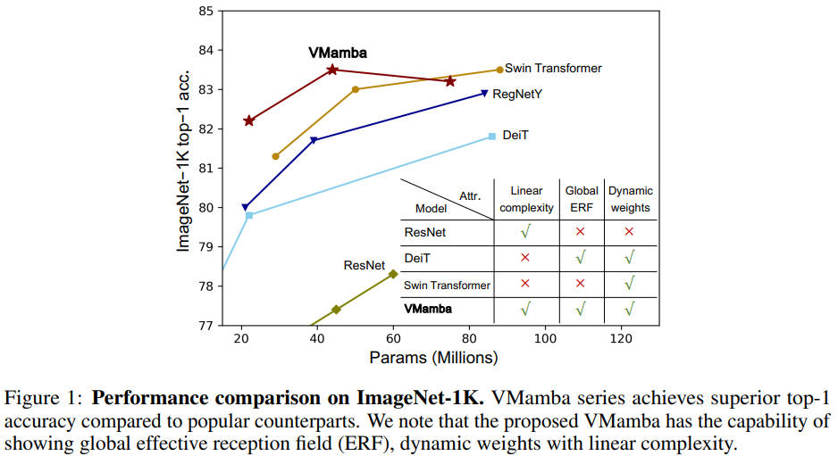
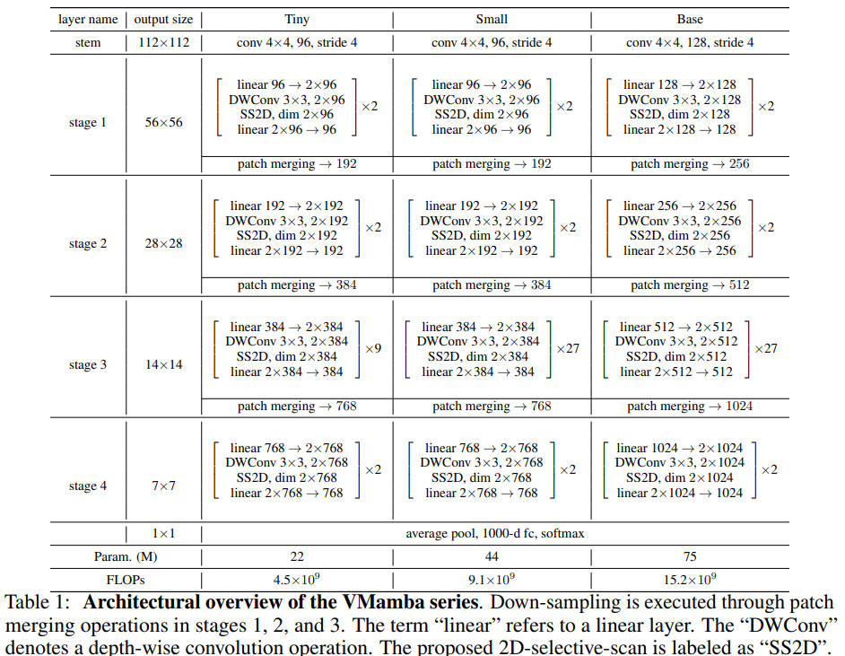
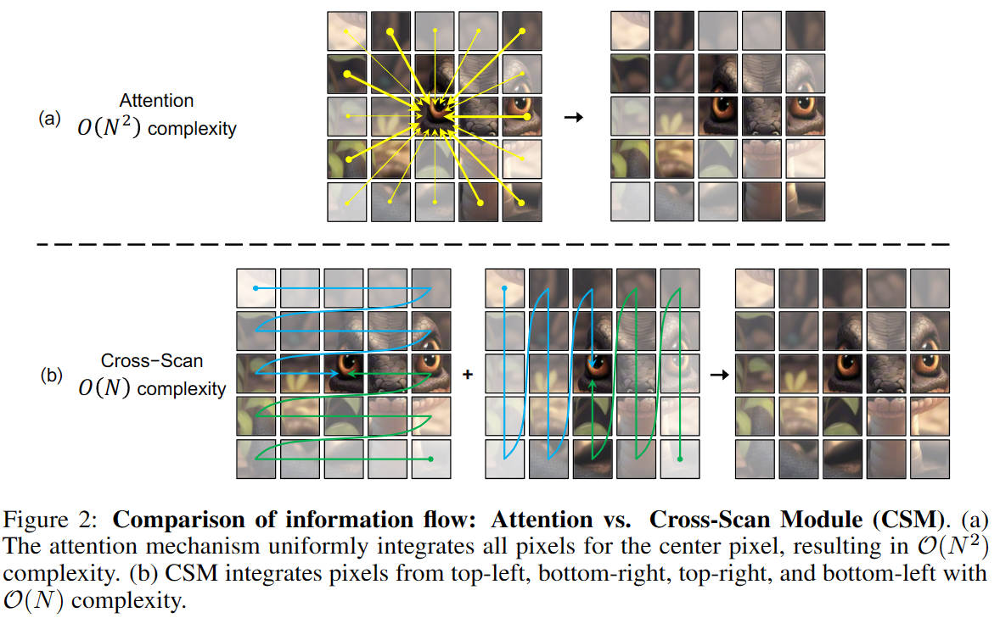
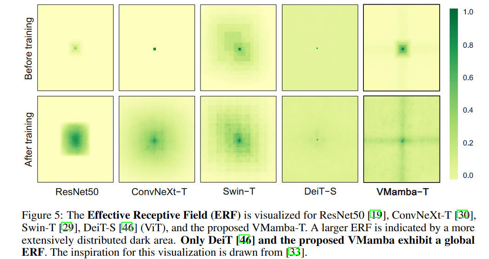
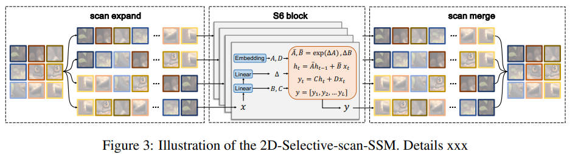
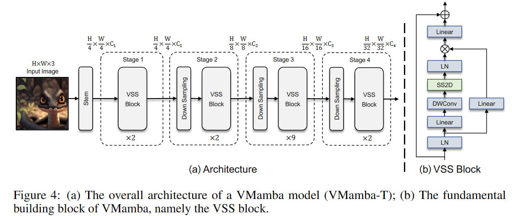
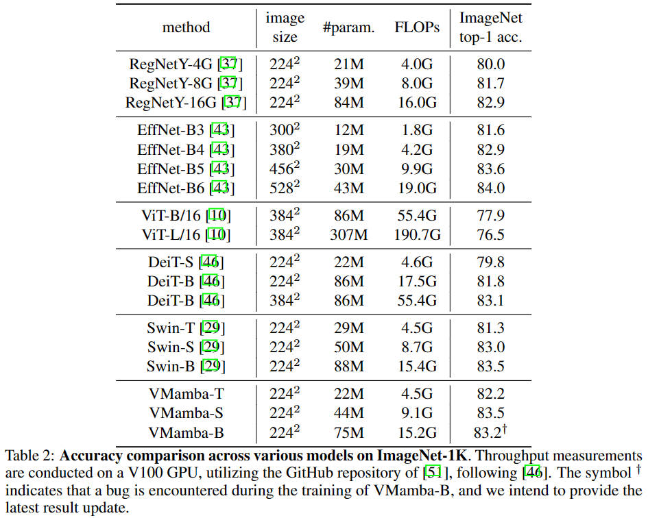
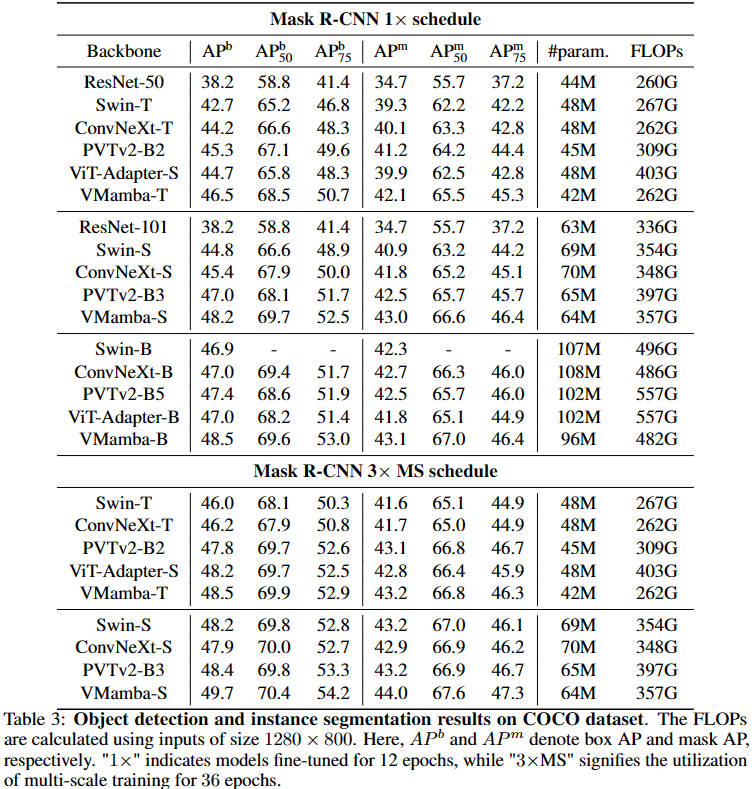
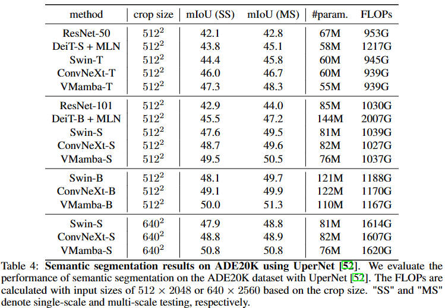

# VMamba: Visual State Space Models


This repo is the official implementation of ["VMamba: Visual State Space Models"](?) as well as the follow-ups. It currently includes code and models for the following tasks:

> **Image Classification**

> **Object Detection and Instance Segmentation**

> **Semantic Segmentation**

## Updates

***01/18/2024***

Initial commits:
1. The supported code and models for ImageNet-1K image classification, COCO object detection and ADE20K semantic segmentation are provided.

TODO:
1. Pretrained models on ImageNet-1K ([VMamba-T-IN1K](...), [VMamba-S-IN1K](...), [VMamba-B-IN1K](...)) are provided.

## Introduction

**VMamba (VSSM)** is initially described in [arxiv](?), which capably serves as a
general-purpose backbone for computer vision with linear complexity, 
while still preserving the advantages associated with global receptive fields and dynamic weights.

VMamba achieves strong performance on COCO object detection (`49.7 box AP` and `44.0 mask AP` on COCO val 2017) and
ADE20K semantic segmentation (`50.8 mIoU` on val), with only 44M parameters for backbone.

<p align="center">
  
</p>
<p align="center">
  
</p>
**VMamba is linear complexity with 2D-Selective-Scan**

<p align="center">
  
</p>

**VMamba has global effective receptive field**

<p align="center">
  
</p>

**Main Architecture of VMamba**

<p align="center">
  
</p>
<p align="center">
  
</p>

## Main Results on ImageNet

**ImageNet-1K VMamba Models**




<!-- | name | pretrain | resolution |acc@1 | acc@5 | #params | FLOPs | FPS| 22K model | 1K model |
| :---: | :---: | :---: | :---: | :---: | :---: | :---: | :---: |:---: |:---: |
| Swin-T | ImageNet-1K | 224x224 | 81.2 | 95.5 | 28M | 4.5G | 755 | - | [github](...)/[baidu](...)/[config](classification/configs/vssm/vssm_tiny_224.yaml)/[log](...) |
| Swin-S | ImageNet-1K | 224x224 | 83.2 | 96.2 | 50M | 8.7G | 437 | - | [github](...)/[baidu](...)/[config](classification/configs/vssm/vssm_small_224.yaml)/[log](...) |
| Swin-B | ImageNet-1K | 224x224 | 83.5 | 96.5 | 88M | 15.4G | 278  | - | [github](...)/[config](classification/configs/vssm/vssm_base_224.yaml)/[log](...) | -->


## Main Results on Downstream Tasks

**COCO Object Detection (2017 val)**



<!-- | Backbone | Method | pretrain | Lr Schd | box mAP | mask mAP | #params | FLOPs |
| :---: | :---: | :---: | :---: | :---: | :---: | :---: | :---: |
| VMamba-T | Mask R-CNN | ImageNet-1K | 1x | / | / | 48M | 267G |
| VMamba-S | Mask R-CNN | ImageNet-1K | 1x | / | / | 69M | 359G |
| Swin-S | Mask R-CNN | ImageNet-1K | 1x | / | / | 69M | 359G | -->


**ADE20K Semantic Segmentation (val)**



<!-- | Backbone | Method | pretrain | Crop Size | Lr Schd | mIoU | mIoU (ms+flip) | #params | FLOPs |
| :---: | :---: | :---: | :---: | :---: | :---: | :---: | :---: | :---: |
| Swin-T | UPerNet | ImageNet-1K | 512x512 | 160K | 44.51 | 45.81 | 60M | 945G |
| Swin-S | UperNet | ImageNet-1K | 512x512 | 160K | 47.64 | 49.47 | 81M | 1038G |
| Swin-B | UperNet | ImageNet-1K | 512x512 | 160K | 48.13 | 49.72 | 121M | 1188G |
| Swin-B | UPerNet | ImageNet-22K | 640x640 | 160K | 50.04 | 51.66 | 121M | 1841G |
| Swin-L | UperNet | ImageNet-22K | 640x640 | 160K | 52.05 | 53.53 | 234M | 3230G | -->

## Citing VMamba: Visual State Space Models

```
@inproceedings{...}
```

## Getting Started

- For installation, training and testing, please see [modelcard.sh](modelcard.sh) for detailed instructions.

## Third-party Usage and Experiments

***all model files are in classification/models/vmamba, just copy that into your own project and enjoy yourself!*** 


## Contributing

This project is based on Mamba ([paper](https://arxiv.org/abs/2312.00752), [code](https://github.com/state-spaces/mamba)), Swin-Transformer ([paper](https://arxiv.org/pdf/2103.14030.pdf), [code](https://github.com/microsoft/Swin-Transformer)). Thanks for their wonderful works.

